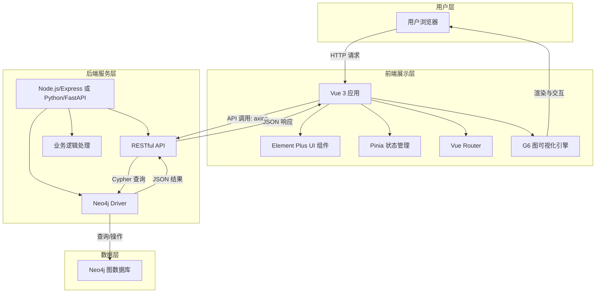

# 图数据可视化演示产品技术选型报告

## 1. 项目概述

**产品名称**： 图数据可视化分析演示平台

**核心目标**： 开发一个用于展示和分析图结构数据的交互式演示产品。产品核心功能包括从图数据库获取数据，并通过丰富、直观的前端界面进行可视化呈现和交互分析。

**关键约束**：
- **数据规模**： 图数据量不大，暂无需考虑超大规模图数据的分布式处理。
- **性质**： 主要用于演示和概念验证（PoC），强调快速开发、美观的视觉效果和流畅的交互体验。

## 2. 选型原则

本次技术选型遵循以下核心原则：
1.  **成熟稳定**： 优先选择经过广泛验证、拥有活跃社区和丰富文档的技术，确保项目顺利推进。
2.  **开发效率**： 选择学习曲线平缓、工具链完善、易于上手的框架，以快速构建原型和迭代。
3.  **演示效果**： 前端框架必须具备强大的数据可视化能力和丰富的交互功能，以打造出色的演示体验。
4.  **轻量灵活**： 由于数据规模不大，技术栈应轻量且易于部署，避免引入不必要的复杂性。

## 3. 技术栈详解

### 3.1. 图数据库

**最终选择：Neo4j (社区版)**

| 项目 | 说明 |
| :--- | :--- |
| **技术类型** | 原生图数据库 |
| **选择理由** | - **查询直观**：其专属的 Cypher 查询语言声明式、易于理解和编写，能直观表达复杂的图关系查询，极大提升开发效率。 - **生态成熟**：业界最流行的图数据库之一，社区活跃，文档、教程和解决方案丰富，遇到问题易于解决。 - **开发体验**：提供友好的 Neo4j Browser 进行数据管理和查询调试，简化开发流程。 - **完美契合**：其属性图模型与业务逻辑匹配度高，完全满足演示规模的数据存储和查询需求。 |
| **替代方案** | EliasDB (轻量级，基于Go，适合嵌入式部署) |

### 3.2. 前端框架

**最终选择：Vue 3 (组合式 API)**

| 项目 | 说明 |
| :--- | :--- |
| **技术类型** | 渐进式 JavaScript 框架 |
| **选择理由** | - **渐进式与易上手**：官方文档优秀，基于 HTML 的模板语法对初学者非常友好，学习曲线平缓，利于快速开发。 - **开发体验**：组合式 API (Composition API) 逻辑组织清晰，代码复用性强。配合 Vite 构建工具，启动和热更新速度极快。 - **生态整合**：官方提供了路由 (Vue Router)、状态管理 (Pinia) 等第一方支持，与 UI 库 (Element Plus) 和可视化库 (G6) 集成简单顺畅。 |
| **替代方案** | React (更灵活，生态更庞大，但学习曲线稍陡峭) |

### 3.3. 图可视化引擎

**最终选择：AntV G6**

| 项目 | 说明 |
| :--- | :--- |
| **技术类型** | 专业图可视化引擎 |
| **选择理由** | - **专业性强**：专为图分析而生，提供力导向、树图、网格等**多种专业布局算法**，能清晰展现复杂的节点关系。 - **交互丰富**：内置缩放、拖拽、点击高亮、Tooltip 等**交互行为**，演示体验极佳，可直接用于交互式分析。 - **高度可定制**：支持自定义节点、边的样式和动画，能满足独特的视觉效果需求。 - **性能优异**：对 Canvas 渲染进行了大量优化，即使节点数据量增长也能保持流畅。 |
| **替代方案** | ECharts (配置化，简单关系图开发更快，但定制和交互能力较弱)、D3.js (能力最强但学习曲线陡峭，开发成本高) |

### 3.4. 辅助技术栈

| 类别 | 技术 | 版本 | 选择理由 |
| :--- | :--- | :--- | :--- |
| **构建工具** | Vite | 最新版 | 启动速度远超 Webpack，提供极致的开发体验，与 Vue 生态完美契合。 |
| **UI组件库** | Element Plus | 最新版 | 为 Vue 3 量身打造，组件丰富、设计优雅，能快速搭建出专业的中后台界面。 |
| **状态管理** | Pinia | 最新版 | Vue 官方推荐的新一代状态管理库，API 设计简洁直观，完美支持 TypeScript。 |
| **路由** | Vue Router | 4.x | Vue 官方路由管理器，是构建单页面应用 (SPA) 的标准选择。 |
| **HTTP客户端** | axios | 最新版 | 基于 Promise 的 HTTP 库，业界标杆，功能强大且易于使用。 |
| **后端语言** | Node.js (Express) / Python (FastAPI) | LTS / 3.8+ | 轻量灵活，JavaScript 全栈统一或 Python 数据生态丰富，均可快速开发 RESTful API。 |
| **后端驱动** | `neo4j-driver` (JS) / `neo4j` (Py) | 最新版 |  respective languages. |

## 4. 系统架构图

**数据流说明**：
1.  前端 Vue 应用初始化，通过 axios 向后台 API 发起请求。
2.  后端服务接收到请求，使用 neo4j-driver 构造 Cypher 查询语句。
3.  驱动执行查询，Neo4j 数据库返回原始结果。
4.  后端对数据进行处理和组织，封装成前端 G6 约定的数据格式（`{ nodes: [], edges: [] }`），以 JSON 形式返回。
5.  前端接收到数据，交由 G6 引擎进行渲染。
6.  用户在前端与图谱进行交互（缩放、拖拽、点击等），G6 负责处理所有交互逻辑。
7.  交互可能触发新的数据请求（如点击展开更多关系），循环步骤 1-6。

## 5. 实施计划与下一步行动

1.  **环境搭建**：
    - [ ] 安装 Node.js、npm/yarn。
    - [ ] 安装并部署 Neo4j 社区版（Docker 或本地安装）。
    - [ ] 使用 `npm create vue@latest` 初始化 Vue 3 项目，集成 Vue Router 和 Pinia。

2.  **依赖安装**：
    - [ ] 安装核心依赖：`npm install element-plus @antv/g6 axios`。

3.  **基础开发**：
    - [ ] 配置 Element Plus 和 G6 的全局引入。
    - [ ] 实现一个简单的后端 API（如 Express），提供静态的图数据接口。
    - [ ] 在前端创建图表组件，集成 G6，实现数据获取和基础渲染。

4.  **迭代开发**：
    - [ ] 连接真实 Neo4j 数据库，实现动态数据查询。
    - [ ] 丰富 G6 的布局和交互配置。
    - [ ] 使用 Element Plus 构建完整的页面布局（侧边栏、导航、控制面板等）。

5.  **测试与部署**：
    - [ ] 功能测试与演示流程演练。
    - [ ] 使用 Vite 构建生产环境版本。
    - [ ] 选择简单的部署方式（如 Netlify, Vercel 用于前端，Heroku 或云服务器用于后端）。

## 6. 风险与应对

| 风险点 | 影响评估 | 应对策略 |
| :--- | :--- | :--- |
| **G6 学习曲线** | 中 | G6 功能丰富，需时间熟悉。**应对**：从官方示例入手，优先使用内置布局和交互，逐步深入。 |
| **前后端数据格式约定** | 低 | 前后端需协同定义 API 数据格式。**应对**：提前明确 G6 所需的数据结构，后端严格遵循。 |
| **Neo4j Cypher 查询优化** | 低 | 复杂查询可能影响性能。**应对**：目前数据量小，风险低。后续可通过创建索引、优化查询语句解决。 |

## 7. 结论与推荐

本报告推荐 **Vue 3 + G6 + Neo4j** 作为核心技术栈。

该组合优势在于：
- **演示效果好**：G6 的专业可视化能力与 Vue 的流畅体验结合，能打造出视觉效果出众、交互性强的演示产品。
- **开发效率高**：Vue 的易学易用与 Neo4j Cypher 的直观，能极大降低开发门槛，快速实现原型和迭代。
- **架构清晰合理**：从前端展示到后端数据处理，再到底层数据存储，技术栈各司其职，层次分明，易于维护和扩展。

该技术选型完全契合项目 **"演示优先、快速开发、数据量小"** 的核心需求，是成功交付项目的坚实基础。

---

**生成日期**： 2023年10月27日
**版本**： 1.0